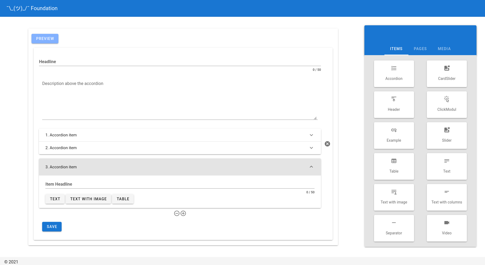

# Foundation



### Vue.Draggable

https://github.com/SortableJS/Vue.Draggable

### Directus

https://github.com/directus/directus

**More information about SQL database structure and dump to create tables and columns:**

https://github.com/GammaGate/foundation/issues/1

## Build Setup

```bash
# install dependencies
$ yarn install

# serve with hot reload at localhost:3000
$ yarn dev

# build for production and launch server
$ yarn build
$ yarn start

# generate static project
$ yarn generate
```

For detailed explanation on how things work, check out [Nuxt.js docs](https://nuxtjs.org).
